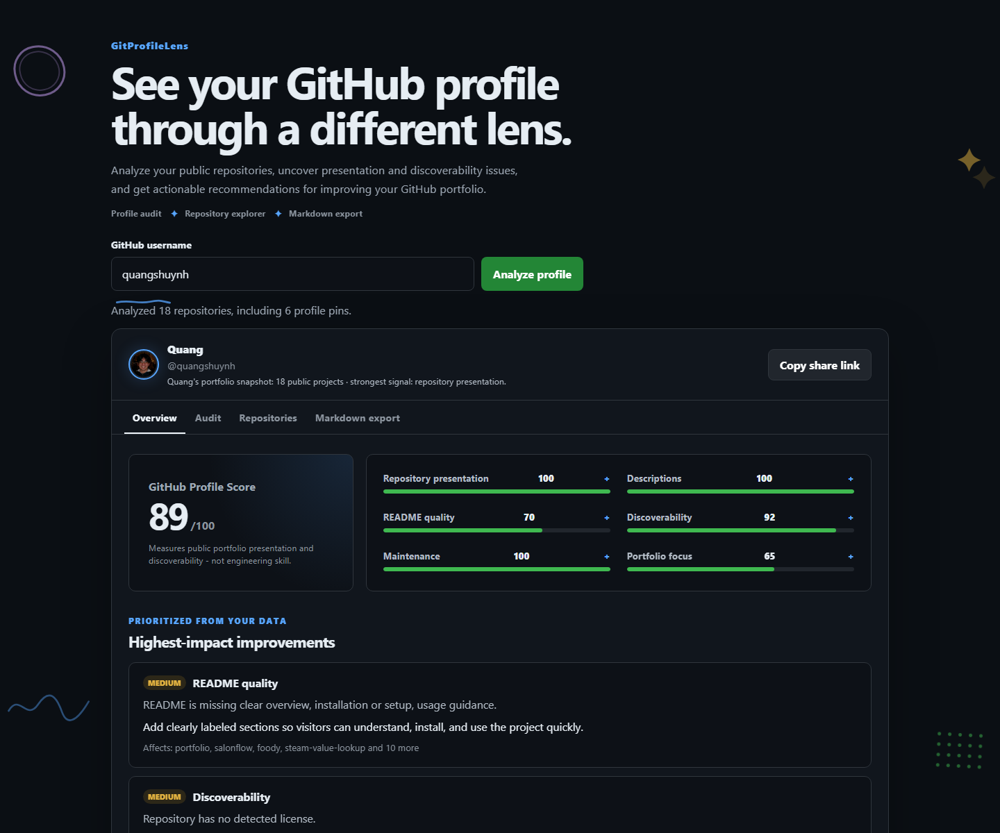

# GitProfileLens

[](https://github.com/quangshuynh/gitprofilelens/actions/workflows/ci.yml)
[](LICENSE)
[](https://gitprofilelens.vercel.app/)

## What's your GitHub portfolio score?

Enter a GitHub username to get a transparent 0–100 portfolio presentation score and actionable recommendations for improving how the public profile and repositories present themselves. GitProfileLens evaluates presentation and discoverability, not developer ability or code quality.

### [Try the live audit →](https://gitprofilelens.vercel.app/)



## Product areas

- **Profile Audit** - Analyze how a developer's public repositories are presented and discovered.
- **Repository Explorer** - Fetch and inspect useful public repository information in one place.
- **Markdown Export** - Generate clean, configurable Markdown from the fetched repository data.

## Key features

- Load every public repository owned by a GitHub user with pagination.
- Open shareable audits such as `/?user=quangshuynh`.
- Share a dynamic score message through the native share sheet or clipboard fallback.
- Download a social-ready PNG score card generated locally in the browser.
- Calculate an overall portfolio score and six explainable category scores.
- Expand any category score to see its calculation and the most common signals affecting it.
- Audit repository names, descriptions, READMEs, topics, licenses, demos, and maintenance signals.
- Separate factual checks from subjective presentation recommendations.
- Rank the five highest-impact portfolio improvements.
- Inspect all fetched repository data without hiding it behind the audit.
- Detect pinned repositories and root README metadata through an optional serverless GraphQL integration.
- Preview, copy, and download Markdown.
- Export all, pinned-only, or manually selected repositories with full or compact details.
- Handle nonexistent users, empty accounts, rate limits, and unavailable supplemental data.

## How the audit works

The scoring implementation lives in `audit.js` and is shared by the browser and automated tests. Each repository receives category scores for:

- Repository presentation: name clarity and consistency.
- Descriptions: specificity, useful length, placeholder text, and basic polish.
- README quality: presence, useful length, core sections (overview, setup, and usage), examples, code samples, visuals, and contribution guidance.
- Discoverability: topics, license, and a demo link where it is likely useful.
- Maintenance: push recency while treating archived projects as intentionally complete.

The profile score aggregates those results and adds portfolio focus. Every finding contains a severity, reason, suggested action, and a flag indicating whether it is a factual check or subjective recommendation.

Unknown README data receives a neutral score and is explicitly marked unverified. The app does not invent README results or AI-generated descriptions.
When structural README data is available, each repository audit card shows a checklist of detected and missing documentation elements alongside its README subscore.

## JSON report API

Other tools can consume the same normalized public repository data used by the browser:

```text
GET /api/report?user=quangshuynh
```

The endpoint returns the username, public repository count, pinned repository names, and serialized public metadata for each repository. It requires the server-side `GITHUB_TOKEN`, performs no HTML scraping, and never includes credentials or private repositories in responses.

## Markdown export

Markdown remains a first-class feature. The export view supports:

- Full repository metadata or a compact name/description/link format.
- Only pinned repositories.
- Only repositories selected in the Repositories view.
- Clipboard copy and `.md` download.

Audit findings are not inserted into the Markdown report.

## Local setup

No client build step or framework is required.

```bash
git clone https://github.com/quangshuynh/gitprofilelens.git
cd gitprofilelens
python -m http.server 8000
```

Open `http://localhost:8000`. Core repository fetching, scoring, browsing, and Markdown export work without login. README and pinned-repository checks appear as unverified unless the serverless integration is running.

### Full local setup

Create `.env.local`:

```text
GITHUB_TOKEN=your_fine_grained_github_token
```

Then use the Vercel CLI:

```bash
vercel dev
```

Never commit `.env.local` or a GitHub token. Local environment files are ignored by Git.

## Architecture

```text
gitprofilelens/
|-- api/
|   |-- github-metadata.js      # shared authenticated GraphQL enrichment
|   |-- pinned-repositories.js  # browser metadata endpoint
|   `-- report.js               # machine-readable JSON report endpoint
|-- tests/
|   |-- audit.test.js           # scoring, recommendation, URL, and transform tests
|   |-- browser.test.js         # anonymous browser flows and responsive checks
|   `-- share.test.js           # sharing and score-card data tests
|-- audit.js                     # deterministic scoring and data transformation
|-- index.html                   # accessible application structure
|-- share.js                     # pure sharing and score-card helpers
|-- script.js                    # fetching, state, rendering, URL, and export behavior
|-- styles.css                   # responsive visual system
`-- package.json                 # test and syntax-check scripts
```

The browser fetches public users and paginated repositories from GitHub REST. The optional Vercel function makes one authenticated GraphQL request for up to 100 root README checks and the profile's pinned repositories. It caches successful responses for five minutes.

## Tests

```bash
npm test
npm run check
npm run test:browser
```

Tests cover scoring behavior and invariants, recommendations, normalization, API failures, Markdown filtering, anonymous share-link loading, dynamic share content, and responsive browser flows. Network boundaries are mocked in the automated suite.

## Deployment

### Vercel (all features)

Deploy the repository and configure `GITHUB_TOKEN` in the Vercel project environment. The token stays in the serverless function and is never sent to the browser.

### GitHub Pages (core features)

GitHub Pages can host the static client. Repository fetching, auditing, sharing, and Markdown export work, but Pages cannot run the serverless function; README and pinned data will be labeled unverified.

## Limitations

- Unauthenticated GitHub REST requests have a low hourly rate limit. The app reports the reset time when GitHub supplies it.
- Root README and pin checks require the optional authenticated function.
- The GraphQL README query covers the first 100 public repositories and checks common root filenames: `README.md`, `README`, and `readme.md`.
- README size is only a useful warning signal; it cannot determine writing quality.
- Recommendations are deterministic presentation guidance, not an assessment of code quality or developer ability.
- A share URL re-fetches current public data; no audit snapshot or database is stored.

## Contributing

Think a scoring rule should work differently? [Open an issue](https://github.com/quangshuynh/gitprofilelens/issues) with a concrete example and rationale. Constructive feedback about transparent portfolio scoring is welcome.

1. Create a focused branch.
2. Keep scoring changes deterministic and document their rationale.
3. Add or update behavior-focused tests.
4. Run `npm test` and `npm run check`.
5. Open a pull request describing user-facing changes and scoring tradeoffs.

## License

Feel free to use, modify, and build on this project.
